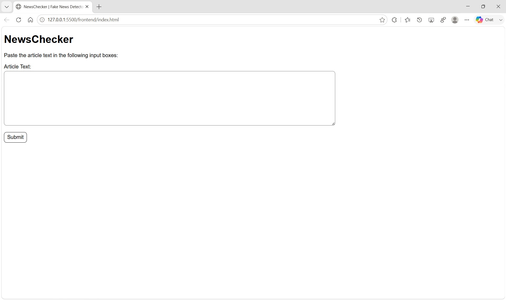
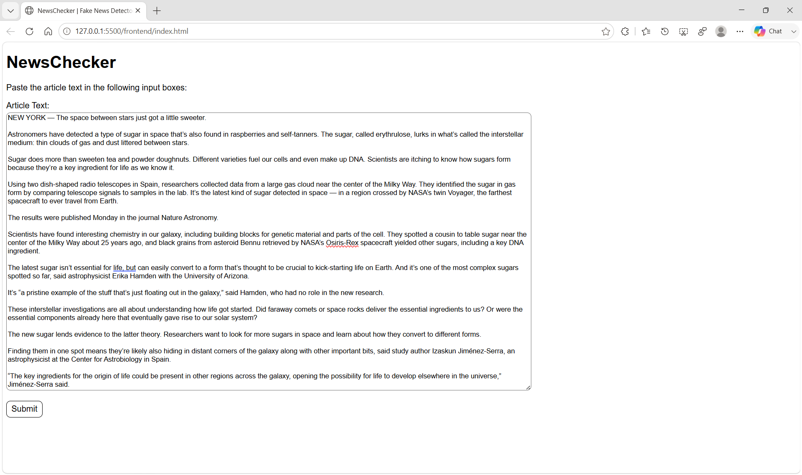
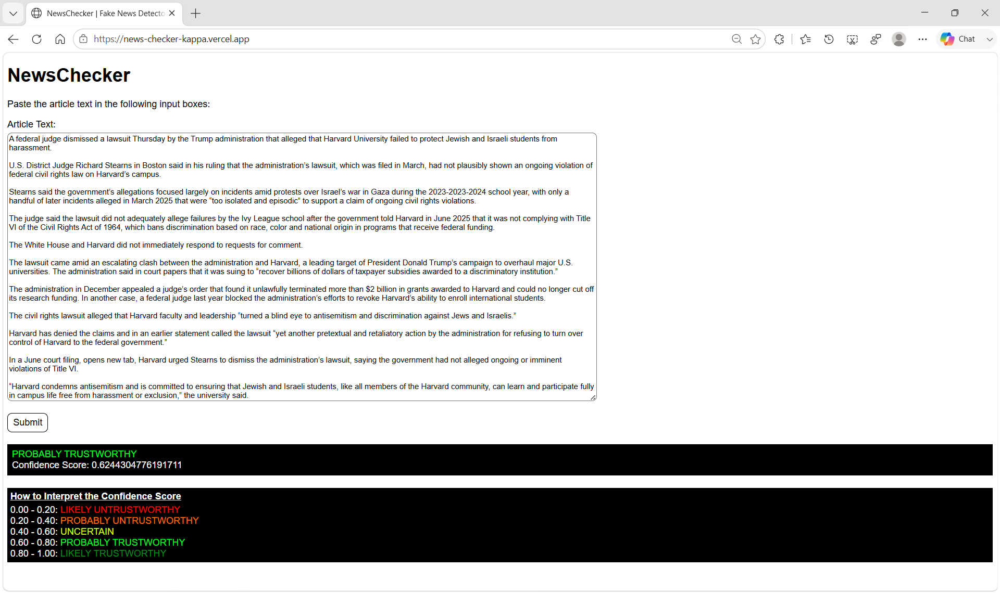
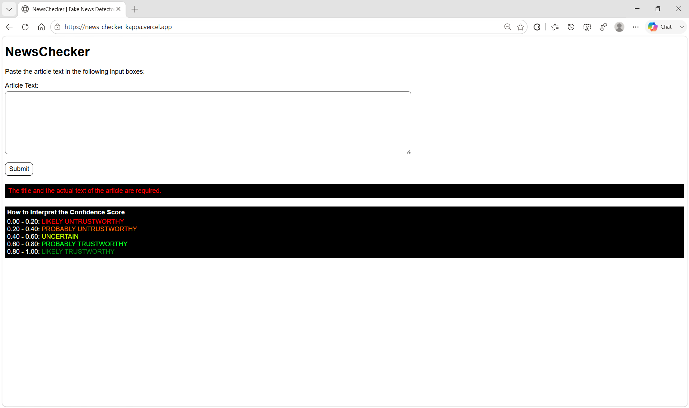
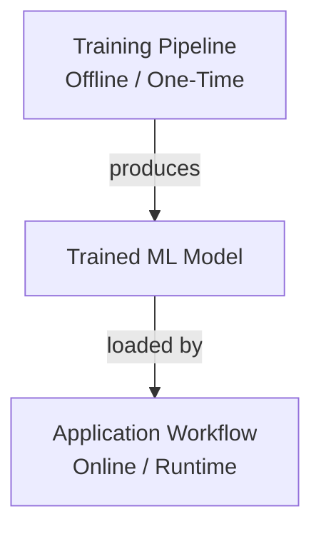
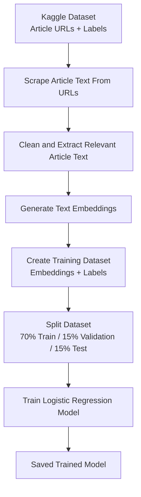
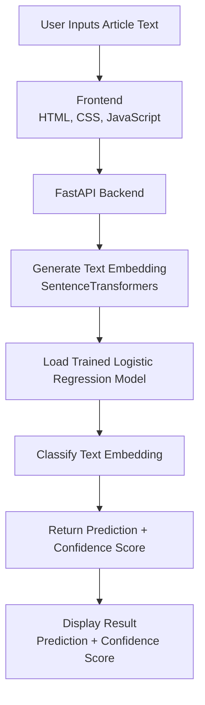

# NewsChecker

NewsChecker is an AI-powered fake news detection web application that analyzes online news articles using natural language processing and machine learning to predict whether an article is likely to be real or fake.

**Live Demo:** (link)

## Project Overview

### What is NewsChecker?

NewsChecker is a machine learning-powered web application that analyzes the content of news articles and predicts whether they are likely to be real or fake. Instead of basing its prediction on specific keywords or manually selected characteristics, the application converts each article into semantic embeddings that capture its overall meaning. Because articles can express the same ideas using different words, this allows the trained machine learning model to make predictions based on the article's content rather than its wording. The model then uses these embeddings to predict whether the article is likely to be real or fake.

### Why I Built It

I built NewsChecker to learn how to create a complete machine learning application, from preparing training data to building a web application that people can use. Instead of only training a machine learning model, I wanted to build the entire system. This included preparing news articles for training by scraping, cleaning, and converting them into embeddings, as well as creating a user interface where people can submit article text and receive a prediction in real time.

### How It Works

NewsChecker consists of two primary workflows:

#### Training Pipeline

The machine learning model was trained using a Kaggle dataset that contained news article URLs and their corresponding labels (real or fake), rather than the article text itself. To prepare this data for training, I built a preprocessing pipeline that automatically visited each URL, scraped the article content, cleaned the extracted text, and converted each article into a semantic embedding. These embeddings, paired with their labels, formed the final training dataset used to train the machine learning model.

#### Application Workflow

Once the model was trained, the preprocessing pipeline was no longer needed during normal application use. Instead, users provide the text of a news article directly through the web interface. Because the application already receives the article text, it simply converts the article text into a semantic embedding using the same embedding model employed during training and passes that embedding to the trained classifier. The model then predicts whether the article is likely to be real or fake and returns the prediction along with a confidence score.

## Screenshots

### Initial Application Interface



*Figure 1. The initial interface presented to the user upon loading the application.*

### Article Entered Before Analysis



*Figure 2. A news article is entered into the input field before analysis.*

### Classification Results Displayed



*Figure 3. After submission, the application displays the predicted label and confidence score.*

### Empty Submission Error Message



*Figure 4. If the user submits the form without entering article text, the application displays an error message.*

## Features

### Training Pipeline
- Processes a Kaggle dataset that contains links to news articles.
- Extracts the text from each news article.
- Cleans the extracted text by removing advertisements, navigation menus, and other content that is not part of the main article text.
- Converts each article into a text embedding for machine learning.
- Uses six parallel Python processes to process multiple articles simultaneously, reducing the time required to generate the processed dataset.
- Splits the processed dataset into training, validation, and testing datasets.
- Saves the processed datasets as .npy files for efficient model training.

### Application
- Accepts the full text of a news article as user input.
- Converts submitted article text into a semantic embedding using the same embedding model used to train the machine learning model.
- Uses the trained machine learning model to classify the submitted article based on its generated embedding.
- Displays the model's prediction and confidence score.

## Tech Stack
**Frontend:** HTML, CSS, JavaScript

**Backend:** FastAPI

**Machine Learning:** Scikit-learn, SentenceTransformers

**Data Processing & Web Scraping:** NumPy, Pandas, BeautifulSoup

**Development Environment:** Jupyter Notebook, VS Code

**Version Control:** Git, GitHub

## Architecture Diagram

### Overall Architecture



### 1. Training Pipeline (Offline / One-Time)

Executed once during model development. Not used by the deployed application.



### 2. Application Workflow (Online / Runtime)

The following diagram illustrates the runtime workflow of NewsChecker, from user input to the displayed prediction and confidence score.



## How to Run Locally

### 1. Clone the repository

Clone the repository and move into the project directory.

```bash
git clone https://github.com/yourusername/NewsChecker.git
cd NewsChecker
```

### 2. Create and activate a Python virtual environment

A virtual environment creates an isolated Python environment for this project. This keeps NewsChecker's dependencies separate from other Python projects on your computer and helps prevent package version conflicts.

**Windows**
```bash
python -m venv .venv
.venv\Scripts\activate
```

**macOS/Linux**
```bash
python -m venv .venv # If `python` doesn't work, try `python3` instead.
source .venv/bin/activate
```

### 3. Install the required Python dependencies

With the virtual environment activated, install all required dependencies.

```bash
pip install -r requirements.txt
```

### 4. Start the FastAPI server

Launch the backend using Uvicorn.

```bash
uvicorn backend.main:app --reload --port 8000
```


By default, the API will be available at:

```
http://127.0.0.1:8000
```

### 5. Launch the frontend

Launch `index.html` using VS Code's Live Server extension.

Ensure the FastAPI backend is running at:

```
http://127.0.0.1:8000
```

Once both the frontend and backend are running, you can begin analyzing news articles.

## Future Improvements

### Improved Fact Verification
Currently, NewsChecker primarily analyzes article text and linguistic patterns. Future versions could incorporate external fact-checking sources and trusted databases to compare claims against verified information.

### Better Explainability
Add explainable AI features to show users why an article received a particular prediction, such as highlighting influential sentences or identifying suspicious patterns.

### Advanced Source Analysis
Incorporate additional signals such as publisher reputation, article metadata, publication history, and author credibility to improve prediction accuracy.

### Improved Multilingual Support
Expand multilingual capabilities by supporting more languages and improving translation quality before generating embeddings.

### Continuous Model Improvement
Develop a pipeline for collecting new examples, retraining models, and monitoring performance as misinformation techniques evolve.

### Multimodal Misinformation Detection
Future versions could analyze images, videos, and other types of content to determine how likely they are to be real or misleading.